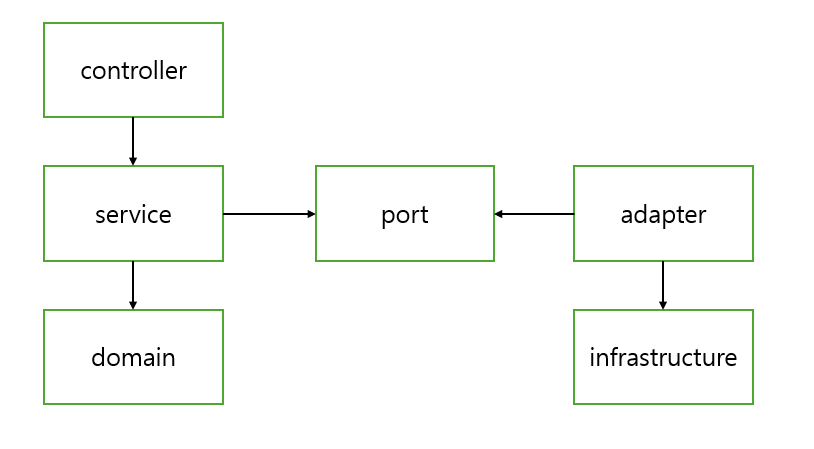

# 아키텍처 설명
본 프로젝트는 다음의 원칙과 철학을 기반으로 설계하였습니다.

## 설계 철학

- **도메인 중심 설계 (DDD-Lite)**  
  도메인별로 책임을 나누고, 기능이 아닌 **업무 단위(유스케이스)** 를 중심으로 구성합니다.


- **계층 구조 기반 (Layered Architecture)**  
  Controller, Application(usecase), Domain, Infrastructure 계층으로 나누되, 유연하게 적용합니다.


- **의존성 역전 원칙 (Dependency Inversion Principle)**  
 현재 외부연동이라고 할 것이 없어 infrastructure이 존재하지 않지만 
 상위 계층(도메인, 유스케이스)이 하위 계층(외부 시스템)에 의존하지 않도록 port&adapter 인터페이스를 통한 추상화 구조를 사용합니다.


## 패키지 구조
```
kr.hhplus.be.server.{domain}
├── controller/              # 표현 계층
├── usecase/                 # 애플리케이션 계층  
├── domain/                  # 도메인 계층
└── infrastructure/          # 외부 유틸리티(현재는 없음)
```

## 계층 설명

| 계층                 | 책임 |
|--------------------|------|
| **Controller**     | HTTP 요청 처리 및 입출력 DTO 변환 |
| **UseCase**        | 한 가지 유스케이스만 담당하는 Application Layer |
| **Domain**         | 비즈니스 규칙, Entity, 도메인 로직 |
| **infrastructure** | 외부 시스템 연동 등 |

## 유스케이스 단위 ApplicationService

- 각 서비스는 **하나의 유스케이스만 담당**합니다.
- 입출력을 명시적으로 구분하여 `Input`, `Output` 클래스를 함께 정의합니다.
- 유스케이스는 **도메인 로직을 호출**하고, 결과를 반환합니다.
```java
public class 시나리오이름 {

    public static class Input { ... }
    public static class Output { ... }

    public Output execute(Input input) {
        // 유스케이스 로직
        // 도메인 객체 생성 및 도메인 메소드 호출
        Product product = productRepository.findById(input.productId);
        
        // 도메인 로직 실행
        user.purchaseProductWithPoint(product, input.point);

        // 결과 반환
        return new Output(...);
    }
}
```
## 구조 선택 배경
이 구조는 다음과 같은 실무적 요구에 맞추어 선택되었습니다:

- 메서드가 아니라 클래스를 검색하면 되어 가독성이 좋아진다
- 변경사항이 있어도 명확하게 변경이 필요한 파일만 수정할 수 있다
- 필요한 의존성만 주입할 수 있어 테스트가 용이하다 
- 비즈니스 규칙은 도메인에, 흐름과 외부 협력은 Application 계층에 집중

## 참고한 아키텍처 사상
- Clean Architecture
- Hexagonal Architecture (Port & Adapter)
- UseCase-Oriented Service Layer
- Layered Architecture
- DDD-Lite

