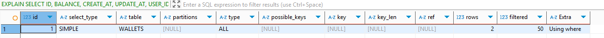

# 데이터 베이스 최적화 보고서
## 📌 잔액 조회 API & 잔액 충전 API
### Before 
```sql
    SELECT
        ID,
        BALANCE,
        CREATE_AT,
        UPDATE_AT,
        USER_ID
    FROM
        WALLETS
    WHERE
        USER_ID = 1
```
- PK가 아닌 USER_ID로 조회하고 있어 인덱스가 없으면 전체 스캔이 발생한다.
    
### After 
```sql
CREATE INDEX IDX_WALLETS_USER_ID ON WALLETS (USER_ID);
```
- 인덱스를 통해 조회가 되는 것을 확인할 수 있다.
  

## 📌 상품조회 API
- 이미 PK로 조회하고 있어서 대상에서 제외하였다.
- 상품 조회 API는 자주 호출되는 API이므로,
  인기상품을 위주로 일부 캐싱하는 방식을 통해 성능을 개선할 수 있을 것으로 보인다.

## 📌 주문/결제 API
### Before 
```sql
    SELECT
        O1_0.ID,
        O1_0.CREATE_AT,
        O1_0.DISCOUNT_AMOUNT,
        O1_0.ISSUED_COUPON_ID,
        O1_0.PAID_AMOUNT,
        O1_0.TOTAL_AMOUNT,
        O1_0.USER_ID
    FROM
        ORDERS O1_0
    WHERE
        O1_0.USER_ID=1
```
- 주문/결제 로직 중 인덱스를 타지 않는 쿼리는 ORDERS 관련 쿼리만 존재한다.
### After 
```sql
CREATE INDEX IDX_ORDERS_USER_ID ON ORDERS (USER_ID);
```
- 인덱스를 통해 조회되는 것을 확인할 수 있다.
  


## 📌 선착순 쿠폰 발급 API
- 쿠폰 발급 로직 중 인덱스 타지 않는 것이 없어 대상에서 제외하였다.

## 📌 인기 판매 상품 조회 API
### Before 
```sql
    SELECT
        P1_0.ID,
        P1_0.CREATE_AT,
        P1_0.NAME,
        P1_0.PRICE,
        P1_0.STOCK_QUANTITY,
        P1_0.UPDATE_AT
    FROM
        ORDER_ITEMS OI1_0
            JOIN
        PRODUCTS P1_0
        ON OI1_0.PRODUCT_ID=P1_0.ID
    WHERE
        OI1_0.REG_DATE BETWEEN '2025-07-29T00:00:00.000' AND '2025-08-01T00:00:00.000'
    GROUP BY
        P1_0.ID
    ORDER BY
        COUNT(OI1_0.ID) DESC
    LIMIT
        5
```
- ORDER_ITEMS 테이블은 REG_DATE 와 PRODUCT_ID 로 조회하고 있어 인덱스가 없어 전체 스캔이 발생한다.
- PRODUCTS 테이블은 PK로 조회하고 있어 빠르게 처리된 것을 확인해볼 수 있다.
  

### After 
1. 쿼리 생성 시점에 일자에 대한 조건 조회가 필요하므로 성능을 위해 reg_date를 추가한 반정규화를 시행하였다.
2. ``WHERE`` → ``JOIN`` → ``GROUP BY`` 순서로 쿼리가 진행되므로 
    단일 인덱스보다 복합 인덱스를 추가하는 것이 성능을 개선할 수 있다.
    따라서 ``WHERE`` 절에 사용되는 ``REG_DATE``를 먼저 인덱스에 추가하고,
  ``JOIN`` 절에 사용되는 ``PRODUCT_ID``를 추가하여 복합 인덱스를 생성하였다.
    ```sql
    CREATE INDEX IDX_ORDER_ITEMS_REG_DATE_PRODUCT_ID ON ORDER_ITEMS (REG_DATE, PRODUCT_ID);
    ```
    

  - 이전보다 성능은 좋아졌지만 index full scan이 발생하였고 임시테이블이 생성되어 정렬이 발생하였다.

4. ORDER_ITEMS 테이블의 데이터가 적어 index full scan이 발생하고 있는 것으로 추정되어 데이터를 추가 생성하여 실행해보았다.
   
    - type이 range로 변경되어 범위 검색이 발생한 것을 확인할 수 있었다.
    - 하지만 여전히 임시 테이블과 정렬이 발생 중이다.
      - using file sort는 order by에서 발생 중인 것으로 추측하였고,
      - 실행 순서와 상관 없이 범위 인덱스가 먼저 오기에 발생한 문제라고 판단하였다.
5. 인덱스의 순서를 변경하였고 정렬을 application 에서 수행하도록 하였다.
    ```sql
    SELECT
        P1_0.ID,
        P1_0.CREATE_AT,
        P1_0.NAME,
        P1_0.PRICE,
        P1_0.STOCK_QUANTITY,
        P1_0.UPDATE_AT,
        COUNT(P1_0.ID) 
    FROM
        ORDER_ITEMS OI1_0 
    JOIN
        PRODUCTS P1_0 
            ON OI1_0.PRODUCT_ID=P1_0.ID 
    WHERE
        OI1_0.REG_DATE BETWEEN '2025-07-29T00:00:00.000' AND '2025-08-01T00:00:00.000' 
    GROUP BY
        P1_0.ID 
    LIMIT
        5
    ```
    ```sql
    CREATE INDEX IDX_ORDER_ITEMS_PRODUCT_ID_REG_DATE ON ORDER_ITEMS (PRODUCT_ID, REG_DATE);
    ```
   
   - 임시테이블과 정렬이 사라지고 인덱스를 사용하여 GROUP BY가 된 것을 확인할 수 있다.