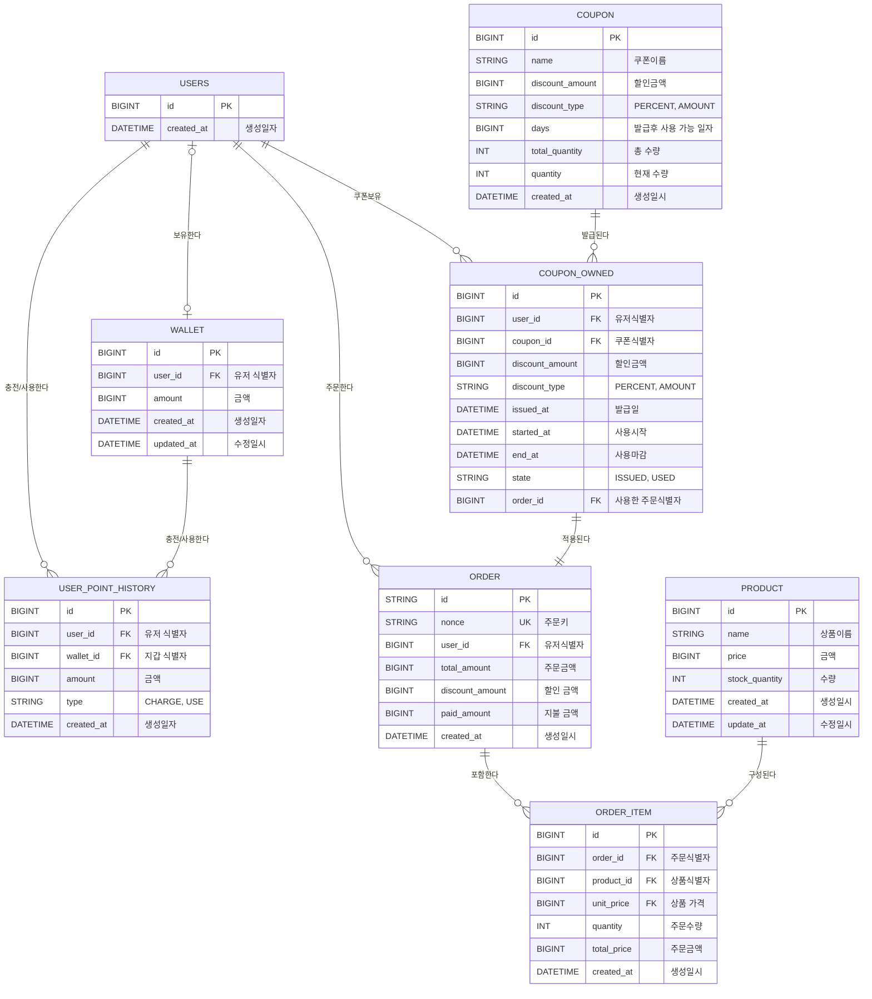

```mermaid
erDiagram
    USERS {
        BIGINT id PK
        DATETIME created_at "생성일자"
    }

    WALLET {
        BIGINT id PK
        BIGINT user_id FK "유저 식별자"
        BIGINT amount "금액"
        DATETIME created_at "생성일자"
        DATETIME updated_at "수정일시"
    }

    USER_POINT_HISTORY {
        BIGINT id PK
        BIGINT user_id FK "유저 식별자"
        BIGINT wallet_id FK "지갑 식별자"
        BIGINT amount "금액"
        STRING type "CHARGE, USE"
        DATETIME created_at "생성일자"
    }

    PRODUCT {
        BIGINT id PK
        STRING name "상품이름"
        BIGINT price "금액"
        INT stock_quantity "수량"
        DATETIME created_at "생성일시"
        DATETIME update_at "수정일시"
    }

    ORDER {
        STRING id PK
        STRING nonce UK "주문키"
        BIGINT user_id FK "유저식별자"
        BIGINT total_amount "주문금액"
        BIGINT discount_amount "할인 금액"
        BIGINT paid_amount "지불 금액"
        DATETIME created_at "생성일시"
    }

    ORDER_ITEM {
        BIGINT id PK
        BIGINT order_id FK "주문식별자"
        BIGINT product_id FK "상품식별자"
        BIGINT unit_price FK "상품 가격"
        INT quantity "주문수량"
        BIGINT total_price "주문금액"
        DATETIME created_at "생성일시"
    }

    COUPON {
        BIGINT id PK
        STRING name "쿠폰이름"
        BIGINT discount_amount "할인금액"
        STRING discount_type "PERCENT, AMOUNT"
        BIGINT days "발급후 사용 가능 일자"
        INT total_quantity "총 수량"
        INT quantity "현재 수량"
        DATETIME created_at "생성일시"
    }

    COUPON_OWNED {
        BIGINT id PK
        BIGINT user_id FK "유저식별자"
        BIGINT coupon_id FK "쿠폰식별자"
        BIGINT discount_amount "할인금액"
        STRING discount_type "PERCENT, AMOUNT"
        DATETIME issued_at "발급일"
        DATETIME started_at "사용시작"
        DATETIME end_at "사용마감"
        STRING state "ISSUED, USED"
        BIGINT order_id FK "사용한 주문식별자"
    }

%% 관계 정의
    USERS |o--o| WALLET : "보유한다"
    USERS ||--o{ ORDER : "주문한다"
    USERS ||--o{ USER_POINT_HISTORY : "충전/사용한다"
    WALLET ||--o{ USER_POINT_HISTORY : "충전/사용한다"
    USERS ||--o{ COUPON_OWNED : "쿠폰보유"

    ORDER ||--o{ ORDER_ITEM : "포함한다"
    PRODUCT ||--o{ ORDER_ITEM : "구성된다"

    COUPON ||--o{ COUPON_OWNED : "발급된다"
    COUPON_OWNED ||--|| ORDER : "적용된다"
```