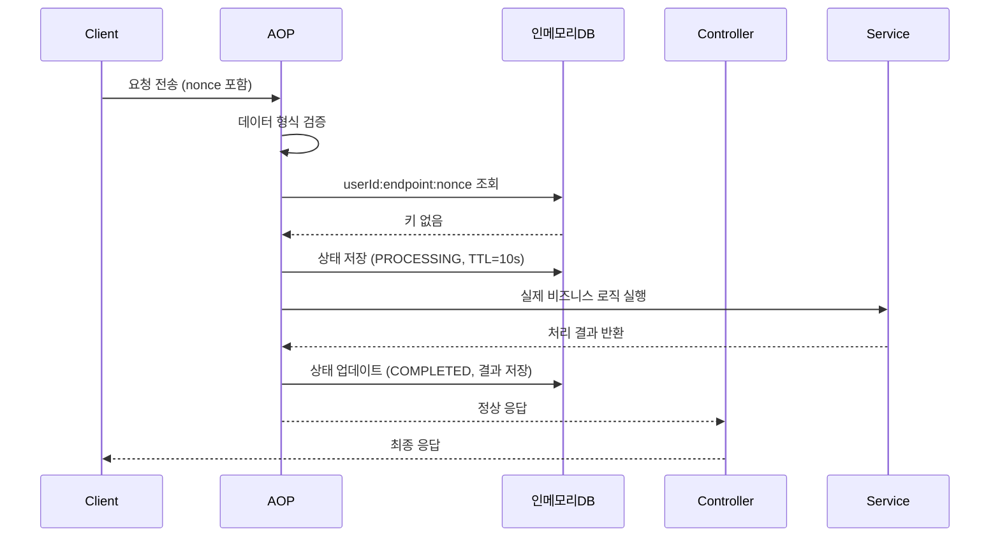
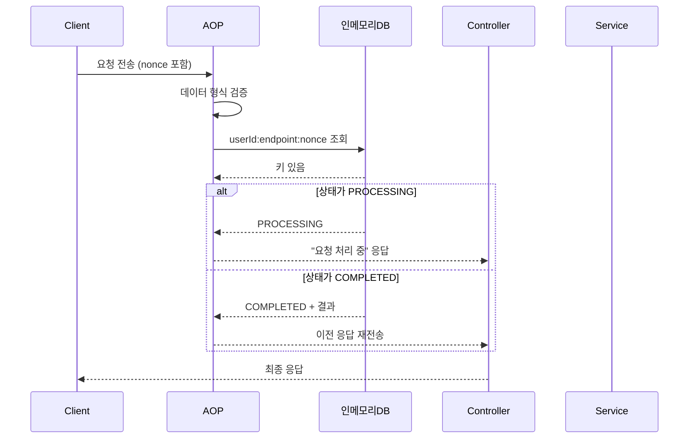
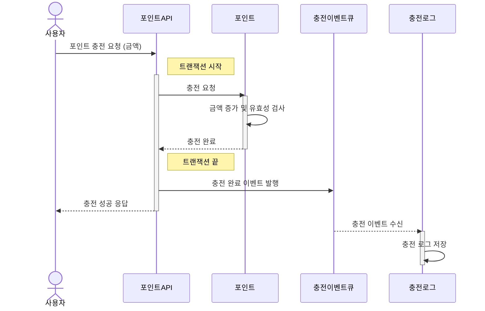
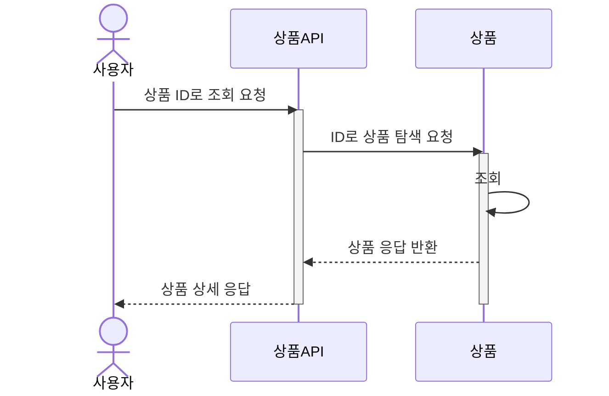
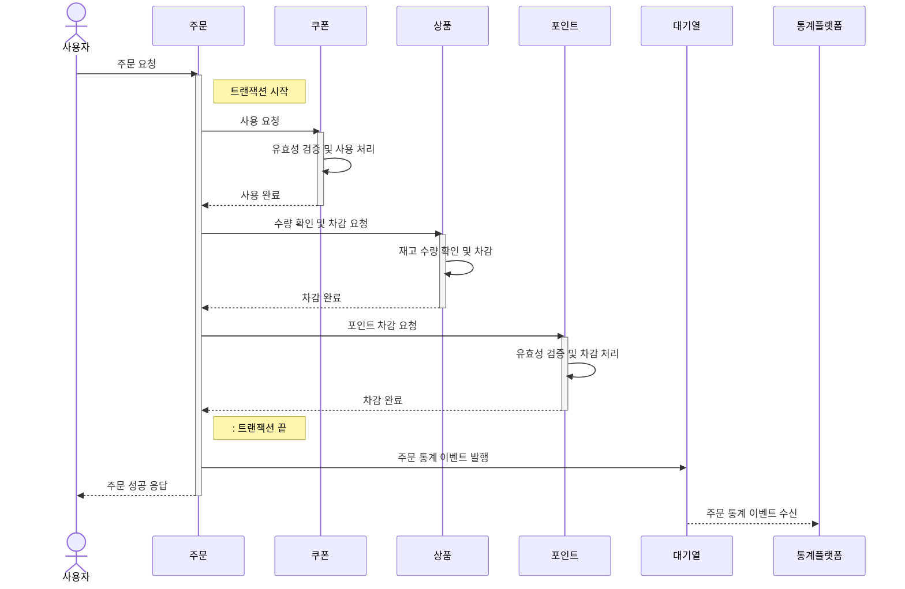
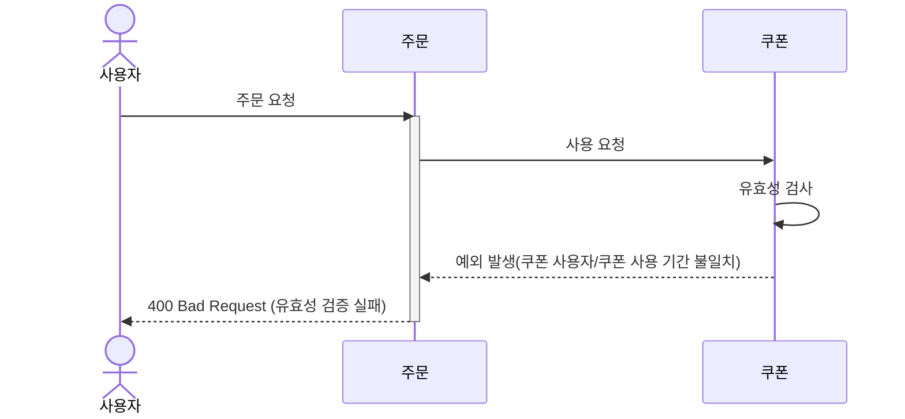
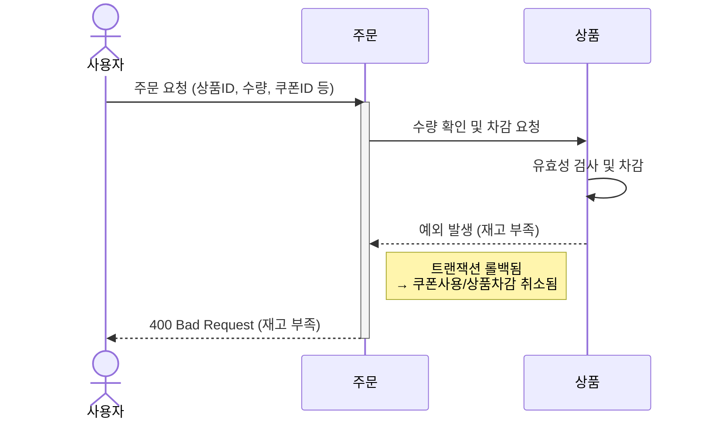
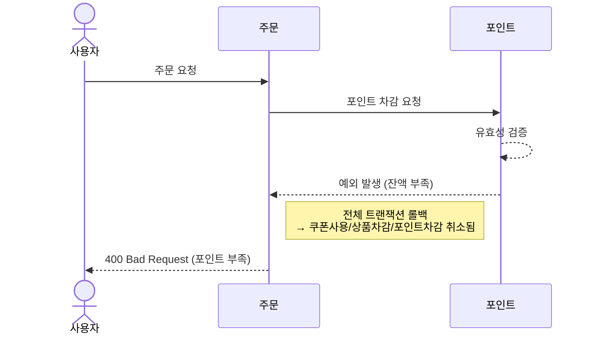
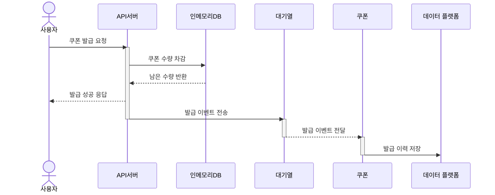
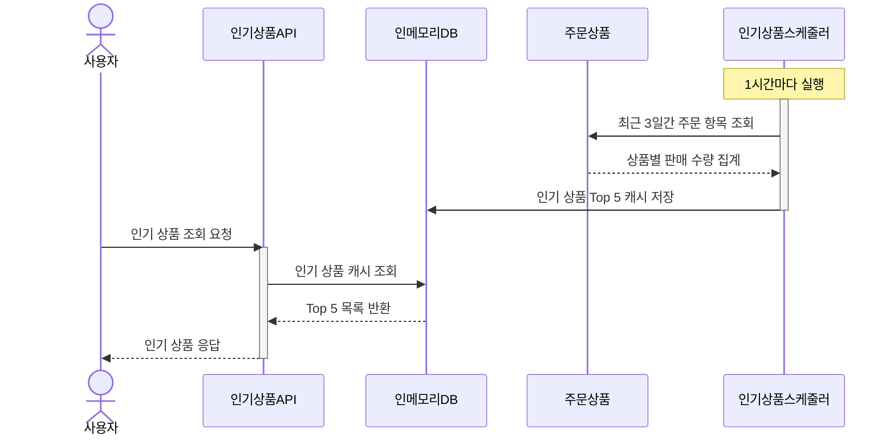

# 0. 공통 멱등성 처리
## 0.1. 중복 요청이 아닌 경우

## 0.2. 중복 요청인 경우

# 1. 잔액충전 API
## 1.1 잔액 충전 성공

# 2. 상품조회 API

# 3. 주문/결제 API

## 3.1. 쿠폰 유효성 검증 실패 예외

## 3.2. 상품 유효성 검증 실패

## 3.3. 포인트 잔액 부족

# 4. 선착순 쿠폰 발급 API

# 5. 인기 판매 상품 조회 API
